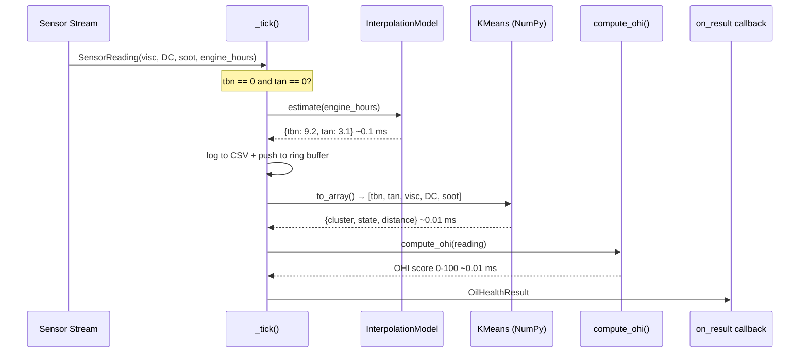
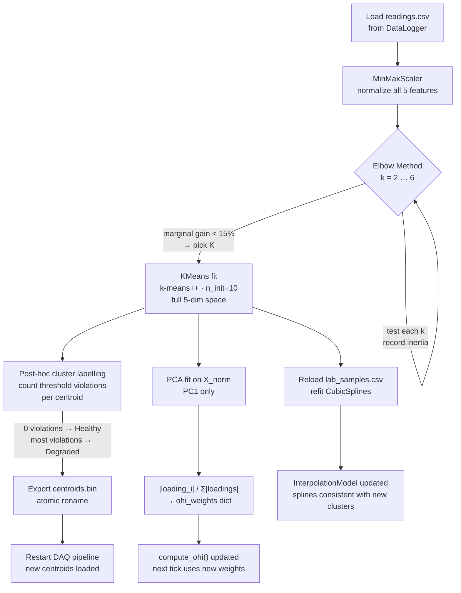
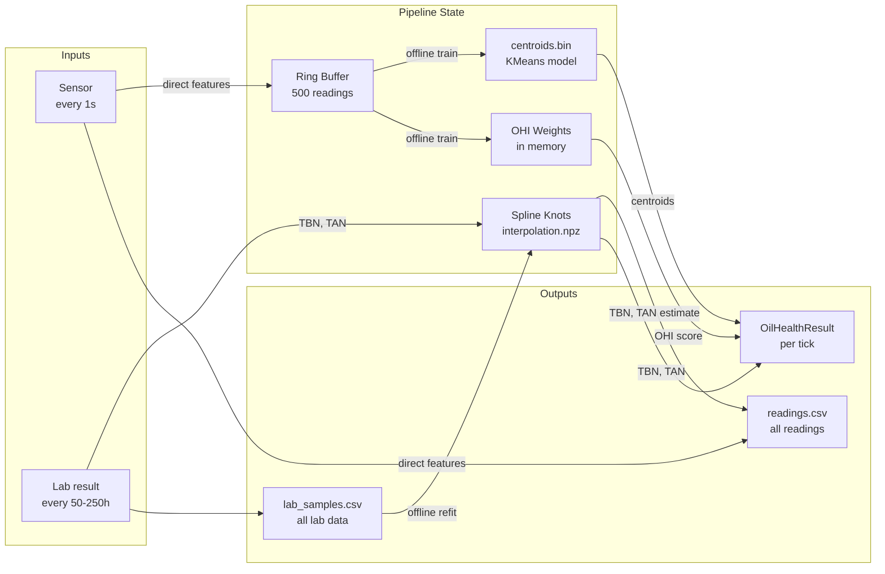

# Oil Health DAQ Pipeline

Real-time engine oil degradation monitoring on Raspberry Pi. Combines live sensor acquisition, sparse lab data interpolation, and unsupervised KMeans clustering to produce a continuous **Oil Health Index (OHI)** score without any labelled training data.

---

## Table of Contents

- [Overview](#overview)
- [System Architecture](#system-architecture)
- [Hot Path — Live Inference](#hot-path--live-inference)
- [Offline Path — Retraining](#offline-path--retraining)
- [Key Components](#key-components)
  - [Sensor Streams](#sensor-streams)
  - [Interpolation Model](#interpolation-model)
  - [Offline Trainer](#offline-trainer)
  - [Oil Health Index](#oil-health-index)
- [Data Flow](#data-flow)
- [File Layout on Device](#file-layout-on-device)
- [Usage](#usage)
- [Configuration Reference](#configuration-reference)
- [Design Decisions](#design-decisions)
- [Extending the System](#extending-the-system)

---

## Overview

Engine oil degrades over time through oxidation, base depletion, viscosity breakdown, and soot accumulation. This pipeline monitors five properties continuously and clusters them into health states — no labelled data required.

| Property | Sensor Type | Degradation Direction |
|---|---|---|
| TBN (Total Base Number) | Lab / onboard estimate | Decreases → bad |
| TAN (Total Acid Number) | Lab / onboard estimate | Increases → bad |
| Viscosity (cSt at 100°C) | Direct sensor | Increases → bad |
| Dielectric Constant | Direct sensor | Increases → bad |
| Soot % | Direct sensor | Increases → bad |

**TBN and TAN** cannot be measured in real time by standard sensors. They are estimated between sparse lab measurements using a fitted CubicSpline — updated instantly whenever a new lab result arrives.

---


---

## Hot Path — Live Inference and system architecture for real-time sensor processing

Runs every tick (default 1 second). **No training, no disk I/O, no blocking calls.**



**Tick budget on RPi 4:**

| Step | Cost |
|---|---|
| Sensor read (serial readline) | ~1 ms |
| Spline eval TBN + TAN | ~0.1 ms |
| CSV log | ~0.2 ms |
| Ring buffer push | ~0.01 ms |
| KMeans Manhattan (NumPy) | ~0.01 ms |
| OHI score | ~0.01 ms |
| **Total** | **~1.3 ms** |

Well within the 1–2 second interval — ~99% of each cycle is idle sleep.

---

## Offline Path — Retraining

Run **after stopping the engine** or from a cron job. Never during live acquisition.



---

## Key Components

### Sensor Streams

Three interchangeable stream factories, all return `SensorReading`:

**Serial** — hardware sensor over UART
```python
stream = make_serial_stream(
    port                = "/dev/ttyUSB0",
    baud                = 9600,
    engine_hours_start  = 1200.0,   # ECU cumulative hours at session start
    tbn_tan_from_sensor = False,     # True if sensor computes TBN/TAN onboard
)
```

Expected CSV from sensor:
```
# tbn_tan_from_sensor=False  (default)
engine_hours,viscosity,dielectric,soot

# tbn_tan_from_sensor=True  (sensor has onboard estimation)
engine_hours,viscosity,dielectric,soot,tbn,tan
```

`engine_hours_start` is added to every `engine_hours` value from the sensor. Use it when the ECU hour-meter is not reset between sessions.

**MQTT** — wireless sensor node
```python
stream = make_mqtt_stream(broker="192.168.1.10", topic="oil/sensor")
# Payload JSON: {"engine_hours":..., "viscosity":..., "dielectric":..., "soot":...}
```

**Simulation** — desktop testing without hardware
```python
stream = make_simulation_stream(seed=42, hours_per_step=0.5)
```

---

### Interpolation Model

TBN and TAN cannot be measured continuously — labs analyse oil samples every 50–250 engine hours. The `InterpolationModel` singleton bridges these gaps.

```mermaid
graph LR
    subgraph Sparse["Sparse lab samples (every 50-250h)"]
        L0["t=0\nTBN=10.74"]
        L1["t=50\nTBN=9.80"]
        L2["t=100\nTBN=8.95"]
        L3["t=200\nTBN=7.81"]
    end

    subgraph Spline["CubicSpline (clamped BC)"]
        SP["fitted once per new knot\n<1 ms · runs inline"]
    end

    subgraph Dense["Dense estimates (every 1s)"]
        D1["t=12.5 → 10.68"]
        D2["t=37.0 → 10.20"]
        D3["t=156.0 → 8.05"]
    end

    Sparse -->|add_lab_sample()| Spline
    Spline -->|estimate(engine_hours)| Dense
```

**Lifecycle:**
1. **Startup** — loads knot arrays from `interpolation.npz` (if exists), else bootstraps from paper data
2. **Runtime** — `estimate(h)` evaluates the spline at any `engine_hours` in ~0.1 ms
3. **Update** — `add_lab_sample()` adds a new knot, refits, and saves atomically; next tick uses the updated curve automatically

**Extrapolation:** Beyond the last knot, a linear fit on the final two knots is used to avoid spline curl.

---

### Offline Trainer

`OfflineTrainer` owns all training logic. It is **never called from `_tick()`**.

**Elbow method** — finds optimal K automatically:

```
k=2  inertia=0.8821   drop=38%  ← still worth adding clusters
k=3  inertia=0.5431   drop=24%  ← still worth it
k=4  inertia=0.4112   drop=10%  ← drop < 15% → stop here, pick K=3
```

The first K where the marginal inertia reduction falls below 15% is chosen. This maps well to the three physical oil degradation stages from the paper: **Initiation → Propagation → Termination**.

**Cluster labelling** — no labels needed. After KMeans, each centroid is checked against physical thresholds from the paper:

| Feature | Threshold | Weight |
|---|---|---|
| TBN | < 5.0 mg KOH/g → degraded (2 pts) | high |
| TAN | > 4.5 mg KOH/g → degraded (1 pt) | medium |
| Viscosity | > 18.5 cSt → degraded (1 pt) | medium |
| Dielectric | > 3.5 → degraded (1 pt) | medium |
| Soot | > 4.0% → degraded (1 pt) | medium |

Centroids with the fewest violations → **Healthy (0)**, most → **Degraded (2)**, middle → **Warning (1)**.

---

### Oil Health Index

OHI is a single score 0–100 (higher = healthier). It uses **data-driven weights** from PCA rather than hardcoded values.

**Formula:**

```
OHI = 100 × Σᵢ ( weightᵢ × health_normᵢ )

where:
  weightᵢ       = |PC1 loading for feature i| / Σ|PC1 loadings|
  health_normᵢ  = normalized feature value mapped to [0=worst, 1=best]
                  (inverted for features where lower = healthier)
```

**Why PCA for weights?** PC1 is the axis of maximum variance in the normalized feature space — i.e. the direction along which oil degrades most strongly. Features with high absolute loading on PC1 are the primary degradation drivers. Their normalized loadings become the weights, so the OHI automatically emphasizes whichever features carry the most degradation signal in your actual data rather than relying on expert-assigned percentages.

Before the first offline train, equal weights (0.2 each) are used as fallback.

---

## Data Flow



---

## File Layout on Device

```
/home/pi/oil_health/
├── models/
│   ├── centroids.bin          # KMeans centroids — written by offline trainer
│   └── interpolation.npz      # TBN/TAN spline knots — written on each lab update
└── data/
    ├── readings.csv           # all sensor readings (direct + derived)
    └── lab_samples.csv        # sparse lab measurements for TBN/TAN
```

---

## Usage

### Live acquisition

```bash
# Simulated stream (no hardware required)
python daq_pipeline.py --source sim

# Real serial sensor
python daq_pipeline.py --source serial --port /dev/ttyUSB0

# Serial sensor where ECU hour-meter reads 1200h at session start
python daq_pipeline.py --source serial --port /dev/ttyUSB0 --engine-hours-start 1200

# Serial sensor with onboard TBN/TAN estimation (6-field CSV)
python daq_pipeline.py --source serial --port /dev/ttyUSB0 --tbn-tan-from-sensor

# MQTT sensor node
python daq_pipeline.py --source mqtt --broker 192.168.1.10
```

### Inject a lab sample (during live session)

```python
daq.ingest_lab_sample(LabSample(engine_hours=150.0, tbn=8.1, tan=3.7))
# Splines refit in <1ms. Next tick uses updated TBN/TAN estimate automatically.
```

### Offline retrain (after engine stops)

```bash
python daq_pipeline.py --retrain
# Runs elbow method, KMeans, PCA weights, rewrites centroids.bin
# Restart the live pipeline after this to pick up the new model
```

### Scheduled retrain via cron (runs at 2am every day)

```cron
0 2 * * * /usr/bin/python3 /home/pi/oil_health/daq_pipeline.py --retrain >> /home/pi/oil_health/retrain.log 2>&1
```

### Console output format

```
[HEALTHY ] OHI: 93/100  [██████████████████░░]  h=  50.0  TBN:9.80(est)  TAN:3.00  Visc:14.2  DC:2.18  Soot:0.3%  (0µs)
[WARNING ] OHI: 61/100  [████████████░░░░░░░░]  h= 150.0  TBN:8.10(est)  TAN:3.70  Visc:17.1  DC:2.85  Soot:2.1%  (0µs)
[DEGRADED] OHI: 22/100  [████░░░░░░░░░░░░░░░░]  h= 250.0  TBN:6.21(est)  TAN:4.36  Visc:31.7  DC:3.11  Soot:4.6%  (0µs)
```

---

## Configuration Reference

| Constant | Default | Description |
|---|---|---|
| `RING_BUFFER_SIZE` | 500 | Max readings kept for offline training |
| `STREAM_INTERVAL` | 1.0 s | Time between sensor reads |
| `ELBOW_K_RANGE` | 2–6 | K values tested during offline elbow search |
| `N_CLUSTERS` | 3 | Default K before first offline run |
| `MODEL_PATH` | `/home/pi/oil_health/models/centroids.bin` | KMeans binary model |
| `INTERP_PATH` | `/home/pi/oil_health/models/interpolation.npz` | Spline knot store |
| `DATA_LOG_PATH` | `/home/pi/oil_health/data/readings.csv` | Sensor reading log |
| `LAB_DATA_PATH` | `/home/pi/oil_health/data/lab_samples.csv` | Lab sample log |

---

## Design Decisions

**Why KMeans instead of supervised classification?**
There are no labelled targets — nobody tagged each oil sample as "good" or "bad". KMeans lets the data form natural clusters, which are then labelled post-hoc using physical threshold rules from the paper. This works because oil degradation has three physically distinct stages (initiation, propagation, termination) that naturally separate in the feature space.

**Why unsupervised PCA for OHI weights instead of hardcoded values?**
Hardcoded weights (e.g. TBN=30%, TAN=25%) are arbitrary and engine-specific. PC1 loadings are derived from the actual variance in your collected data — whichever features are changing most during degradation automatically get higher weight. As more data is collected, the weights self-correct.

**Why is retraining fully offline?**
On a Raspberry Pi, elbow method over k=2..6 takes several seconds. Running that during live acquisition would cause missed readings and violate the 1–2 second update budget. The inference path (spline eval + NumPy Manhattan distance) takes ~0.15ms total — nothing needs to happen at inference time except those operations.

**Why CubicSpline for TBN/TAN rather than a model?**
TBN and TAN follow smooth, physically motivated monotonic curves (base depletion and acid accumulation follow known chemistry). With only 4–6 lab measurements per engine, a spline that passes exactly through known points is more reliable than any learned model. The `clamped` boundary condition enforces smooth behavior at the endpoints.

**Why Manhattan distance for KMeans inference?**
No `sqrt()` — just absolute differences. For 3 centroids × 5 features that is 15 subtractions and 15 absolute values. On normalized [0,1] features, Manhattan and Euclidean produce nearly identical cluster boundaries. The Python training uses Euclidean (sklearn default with k-means++) but the inference uses Manhattan — the centroids are compatible because the normalized space makes the difference negligible.

---

## Extending the System

**More engines / vehicles** — call `ingest_lab_sample()` with an `engine_id` field. The interpolation model currently fits one global spline; splitting by `engine_id` would give per-engine degradation curves and is the natural next step when multi-engine data is available.

**Higher K** — the elbow method will automatically pick a larger K as data accumulates and more degradation sub-stages become distinguishable. No code changes needed.

**Rust inference engine** — `main.rs` and `Cargo.toml` are included in the repo as a scaling path. At 3 centroids × 5 features, pure NumPy (~0.01ms) is fast enough and the subprocess pipe overhead (~0.5ms) would dominate. Rust becomes worthwhile if K grows large (20+), feature count grows significantly, or you need batch scoring of many readings per second simultaneously.

**DBSCAN instead of KMeans** — useful once enough data is collected to identify anomalous oil states that don't fit any cluster (e.g. contamination events, sudden additive breakdown). DBSCAN can label these as outliers rather than forcing them into the nearest centroid.
